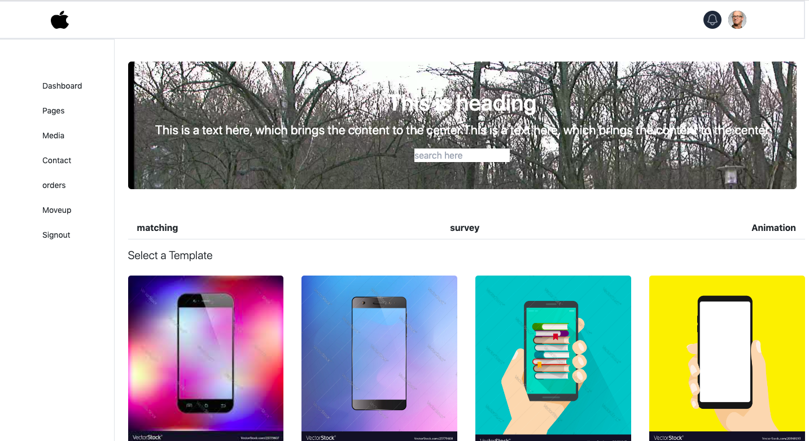
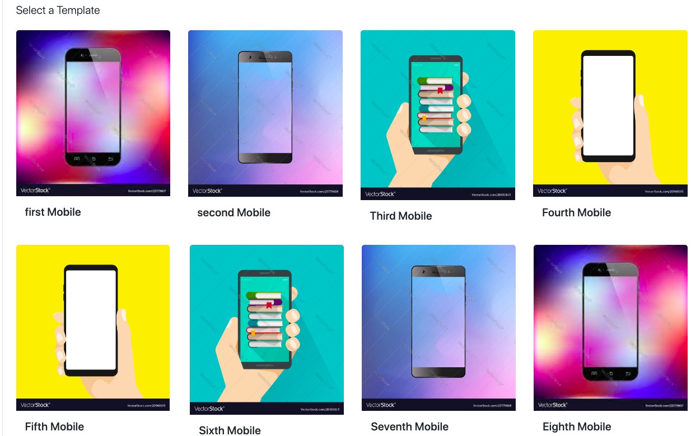

# Navbar and Sidebar section with cards using React libraries

## Description

> In this Project, a Navbar along with the Sidebar and card components has been created using getBootstrap  and Tailwind UI/CSS 

#### To run the project, gitclone and use npm start command by installing the node package to your local host.

### The layout for the project is as shown below 

